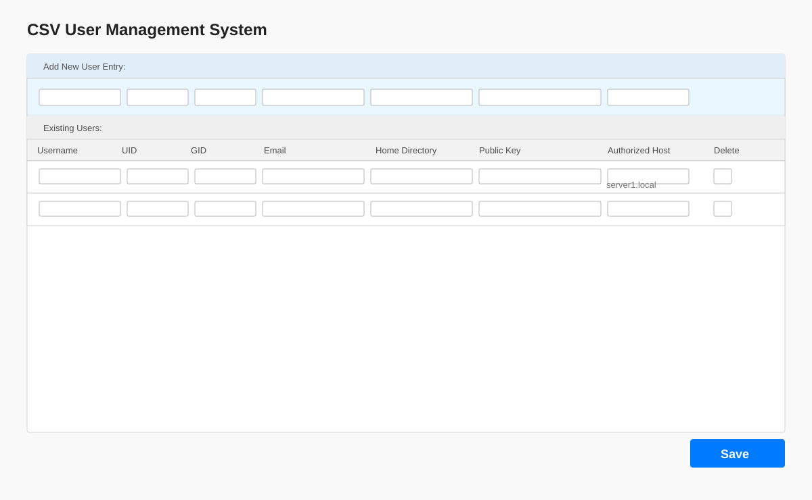
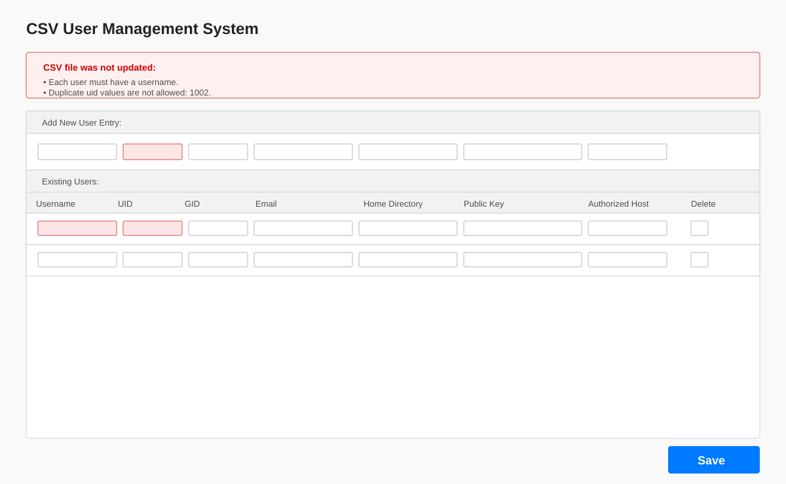

# CSV User Manager

A small authenticated PHP web dashboard for managing users and machine-groups stored in CSV files. The application supports CRUD operations, CSV and generated-block publishing, raw-file inspection/editing, user search, user detail views, and synchronized host membership lists.

## Files

| File | Role |
| --- | --- |
| `index.php` | Application controller: starts the session, handles login/logout, reads and writes both CSV files, synchronizes host memberships, and loads the dashboard |
| `view.php` | HTML dashboard template included by `index.php`; contains the login form and authenticated users/hosts management interface |
| `users.csv` | User records |
| `users-block.txt` | Generated `/etc/passwd`-format user entries; created by the Users List publish action |
| `hosts.csv` | Host records and calculated comma-separated member lists |
| `hosts-block.txt` | Generated `/etc/group`-format machine-group entries; created by the Hosts List publish action |
| `check-remote-groups.sh` | Uses SSH to check configured machine-groups and members on each remote host |
| `Makefile` | Copies `index.php`, `view.php`, `users.csv`, and `hosts.csv` to `/var/www/html` |

## Screenshots





## Authentication

The dashboard requires an authenticated session before either CSV database is displayed or modified.

The current credentials defined in `index.php` are:

```text
Username: admin
Password: secret123
```

Change `ADMIN_USER` and `ADMIN_PASS` in `index.php` before deploying to a shared or production environment. Use the **Logout** link in the dashboard to end the session.

## CSV formats

### `users.csv`

Each row represents one user:

```text
username,uid,gid,email,home-directory,public-key,authorized-host
```

Example:

```csv
username,uid,gid,email,home-directory,public-key,authorized-host
tsandholm,3000,3000,tom.sandholm@gmail.com,/share/home/tsandholm,ssh-rsa AAA...,*
kat,3001,3001,tom.sandholm@gmail.com,/share/home/kat,ssh-rsa AAA...,*
mary,3002,3002,tom.sandholm@gmail.com,/share/home/mary,ssh-rsa AAA...,tom2-tsand-org
```

The `authorized-host` value may be `*` to represent all machine-groups, or a specific machine-group from `hosts.csv`.

When adding a user, the form defaults UID and GID to one higher than the highest numeric value currently assigned in `users.csv`. If either value is omitted from the submitted request, `index.php` applies the same calculation server-side. Editing an existing user preserves its current UID and GID unless they are changed explicitly.

### `hosts.csv`

Each row represents a managed machine-group:

```text
machine-group,group-id,member-list
```

Example:

```csv
machine-group,group-id,member-list
tom1-tsand-org,5000,"tsandholm,ansible,mary"
tom2-tsand-org,5001,"tsandholm,ansible,mike"
tom3-tsand-org,5002,"tsandholm,ansible,iggy"
```

`member-list` is recalculated from `users.csv` whenever a user is saved or deleted, and whenever a machine-group is saved. Users assigned to `*` are included on every managed machine-group; users assigned to a specific machine-group are included only there. `ansible` and `sudo` are always included, duplicate member names are removed, and the remaining names are sorted.

When adding a machine-group, the form defaults Group ID to the next value after the highest numeric `group-id` already assigned in `hosts.csv`. Group IDs start at `5000` when no numeric IDs exist, and the server applies the same fallback when a new machine-group submission leaves the field blank. Editing an existing machine-group preserves its current Group ID unless it is changed explicitly.

## Dashboard features

- Add, edit, and delete users from the **Users List** panel
- Edit username, email, UID, GID, home directory, public key, and authorized machine-group
- View complete user details, including fields hidden from the compact list
- Search visible user rows by username, UID/GID, email, or authorized machine-group
- Add, edit, and delete machine-groups from the **Hosts List** panel
- Display calculated machine-group member lists with sticky headers and internal scrolling
- Keep host membership lists synchronized after user or machine-group changes
- View or edit raw `users.csv` and `hosts.csv` files
- Publish, view, and edit raw `hosts-block.txt` and `users-block.txt` files
- Generate `hosts-block.txt` in `/etc/group` format from `hosts.csv`
- Generate `users-block.txt` in `/etc/passwd` format from `users.csv`
- Suggest the next available UID and GID for new users
- Suggest the next available Group ID for new hosts, starting at `5000`
- Create empty `users.csv` and `hosts.csv` files automatically if they are missing
- Require an authenticated session for dashboard and raw-file access
- Lock raw-file saves with `LOCK_EX` and escape displayed CSV values with `htmlspecialchars`
- Keep the dashboard compact with side-by-side panels and no page-level horizontal or vertical scrollbar; long lists scroll inside their own panels

The user and host forms use browser-level required-field validation. The current PHP handlers write submitted rows directly and do not enforce uniqueness or additional server-side validation, so CSV content should be reviewed before production use.

## Quick Start

1. Make sure PHP is installed.
2. From this directory, start PHP's development server:

   ```sh
   php -S 127.0.0.1:8000
   ```

3. Open `http://127.0.0.1:8000/index.php`.
4. Sign in with the configured credentials.
5. Use the left panel to manage users and the right panel to manage machine-groups.

If either CSV file is missing, `index.php` creates an empty file before loading the dashboard. Add the desired header row and records through the application or prepare the files beforehand.

## Generated system-file blocks

The dashboard can create two deployment-ready text blocks:

| Button | Output | Format |
| --- | --- | --- |
| Hosts List → **Publish** | `hosts-block.txt` | `machine-group:x:group-id:member-list` (`/etc/group` style) |
| Users List → **Publish users-block.txt** | `users-block.txt` | `username:x:uid:gid:email:home-directory:/bin/bash` (`/etc/passwd` style) |

After publishing, use **View Raw ...** to inspect the exact file or **Edit Raw ...** to make a direct authenticated edit. Editing a generated block does not update the source CSV, so source CSV changes should be made when the generated file needs to be regenerated.

## Check remote machine groups

Run the SSH checker from this directory:

```sh
./check-remote-groups.sh
```

The script reads the first column of `hosts.csv` as both the SSH target and remote machine-group name. For example, `tom1-tsand-org` checks the `tom1-tsand-org` group in the remote `/etc/group`.

It reports whether the group was found and, when present, checks each user in the final `member-list` column individually. The script is report-only by default and does not modify remote systems. An alternate CSV path can be supplied:

```sh
./check-remote-groups.sh /path/to/hosts.csv
```

To append only users that are missing from an existing remote group, use:

```sh
./check-remote-groups.sh --apply
```

Apply mode uses `sudo gpasswd --add` for each missing user and verifies the user appears in the group after each append. It never removes existing members or replaces the complete member list. Missing groups are reported but not created. The member-list column contains usernames; `/etc/group` stores usernames rather than numeric user IDs.

## Deploy

Requires PHP, for example Apache with `mod_php` or PHP-FPM. The web server user must be able to read and write `index.php`, `view.php`, `users.csv`, and `hosts.csv`. It must also be able to create or update `hosts-block.txt` and `users-block.txt` when the publish or raw-edit actions are used.

From this directory:

```sh
make push
```

The target copies the PHP application and source CSV files into `/var/www/html`:

```sh
sudo cp index.php /var/www/html
sudo cp view.php /var/www/html
sudo cp users.csv /var/www/html
sudo cp hosts.csv /var/www/html
```

Then open `index.php` through the web server and sign in.
