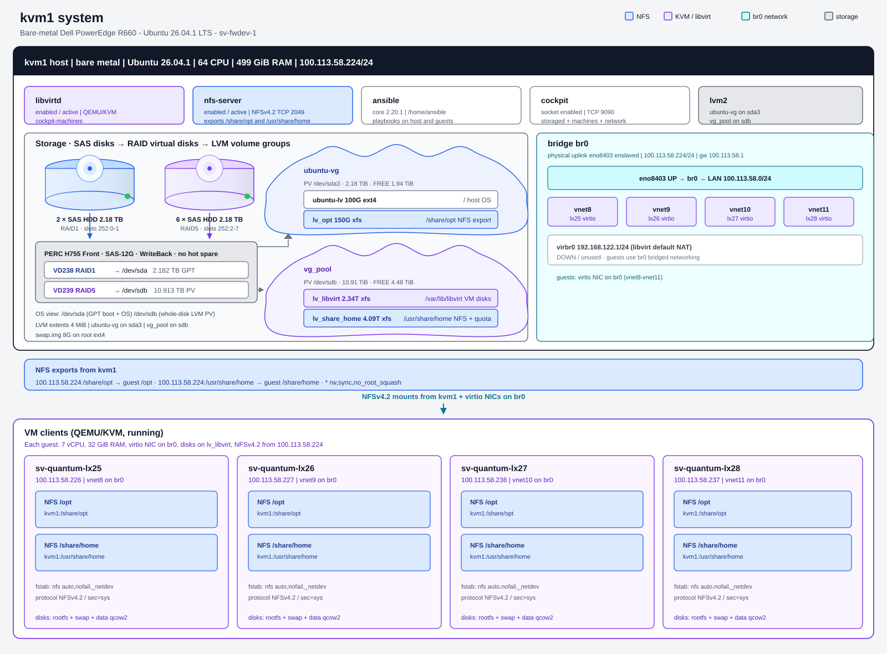
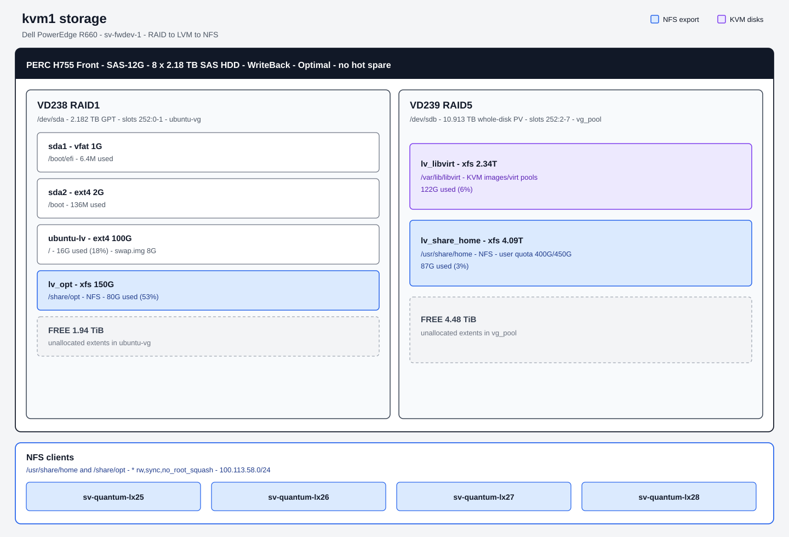
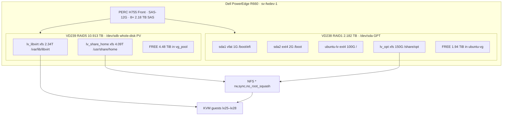

# kvm1 storage architecture summary

**Host:** `kvm1` → `sv-fwdev-1.infinera.com` (`sysadm@sv-fwdev-1`)  
**Scanned:** 2026-09-20 18:42 UTC over SSH  
**Role:** Bare-metal KVM hypervisor and NFS server (not a guest)

---

## Host overview

| Item | Value |
|---|---|
| Hardware | Dell PowerEdge R660, serial 7ZV1KM4 |
| OS | Ubuntu 26.04.1 LTS (Resolute Raccoon) |
| Kernel | `7.0.0-30-generic` x86_64 |
| CPU | 2× Intel Xeon Gold 6526Y, 16 cores / 32 threads each (64 CPUs), VT-x |
| Memory | ~499 GiB usable (~16× 32 GiB DIMMs; 12 TB max) |
| Swap | 8.0 GiB file `/swap.img` on root filesystem (unused at scan) |
| Uptime | 17 days, load ~0.09 |
| Network | `br0` 100.113.58.224/24; `virbr0` 192.168.122.1 (down) |
| Virtualization | `systemd-detect-virt`: none (bare metal) |

Four KVM guests were running at scan time: `sv-quantum-lx25` through `sv-quantum-lx28`. Those guests are also the active NFS clients.



Unused on this host: Linux MD RAID, iSCSI, ZFS, Btrfs, device-mapper multipath (module loaded, not in use), Samba/CIFS, NVMe.

---

## Architectural data path





```
PERC H755 Front (RAID-Mode, SAS-12G)
├── VD238  RAID1  2.182 TB  ──►  /dev/sda   (GPT)
│                                 ├── sda1  vfat   1G     /boot/efi
│                                 ├── sda2  ext4   2G     /boot
│                                 └── sda3  LVM PV 2.18T
│                                       └── VG ubuntu-vg
│                                           ├── LV ubuntu-lv     100G  ext4  /
│                                           ├── LV lv_opt        150G  xfs   /share/opt  ──► NFS
│                                           └── FREE             1.94T
│
└── VD239  RAID5  10.913 TB ──►  /dev/sdb   (whole-disk PV, no partition table)
                                  └── VG vg_pool
                                      ├── LV lv_libvirt      2.34T  xfs  /var/lib/libvirt
                                      ├── LV lv_share_home   4.09T  xfs  /usr/share/home  ──► NFS
                                      └── FREE               4.48T
```

---

## Hardware RAID

**Controller:** PERC H755 Front  
**PCI:** `4a:00.0` Broadcom/LSI MegaRAID 12GSAS/PCIe SAS39xx  
**Serial:** 65D02MF  
**Firmware:** 5.300.02-4300 (package 52.30.0-6753)  
**Driver:** `megaraid_sas` 07.734.00.00-rc1  
**Personality:** RAID-Mode  
**Cache:** WriteBack + Read Ahead (RWBD)  
**Strip size:** 256 KB  
**Enclosure:** 252 (BP_PSV), 10 bays, 8 drives used, **no hot spare**

### Virtual disks

| VD | DG | OS device | RAID | Size | State | Access | Consistent | Cache | Name |
|---|---|---|---|---|---|---|---|---|---|
| 238 | 1 | `/dev/sda` | RAID1 | 2.182 TB | Optimal | RW | Yes | RWBD | `dev-sda` |
| 239 | 0 | `/dev/sdb` | RAID5 | 10.913 TB | Optimal | RW | Yes | RWBD | `dev-sdb` |

- VD238: 2 drives per span, created 2026-08-18 10:25 UTC, NAA `6f4ee08089dc2b003216ef94814356c1`
- VD239: 6 drives per span, created 2026-08-18 10:22 UTC, NAA `6f4ee08089dc2b003216eefb9e5b1811`

### Physical disks

All eight drives are SAS HDD, 2.182 TB, 512-byte sectors, model **CL2400MM0149**, SED capable, spun up, Online.

| EID:Slot | DID | State | DG | Role |
|---|---|---|---|---|
| 252:0 | 1 | Onln | 1 | RAID1 member (`sda`) |
| 252:1 | 7 | Onln | 1 | RAID1 member (`sda`) |
| 252:2 | 6 | Onln | 0 | RAID5 member (`sdb`) |
| 252:3 | 5 | Onln | 0 | RAID5 member (`sdb`) |
| 252:4 | 4 | Onln | 0 | RAID5 member (`sdb`) |
| 252:5 | 3 | Onln | 0 | RAID5 member (`sdb`) |
| 252:6 | 2 | Onln | 0 | RAID5 member (`sdb`) |
| 252:7 | 0 | Onln | 0 | RAID5 member (`sdb`) |

OS also sees Intel Sapphire Rapids SATA AHCI controllers; they are not presenting the data disks. `/proc/mdstat` is empty.

---

## Block devices (OS view)

`lsblk` (model: DELL PERC H755 Front):

| Name | Type | Size | FSTYPE | Mount |
|---|---|---|---|---|
| `sda` | disk | 2.2T | | |
| `sda1` | part | 1G | vfat | `/boot/efi` |
| `sda2` | part | 2G | ext4 | `/boot` |
| `sda3` | part | 2.2T | LVM2_member | |
| `ubuntu--vg-ubuntu--lv` | lvm | 100G | ext4 | `/` |
| `ubuntu--vg-lv_opt` | lvm | 150G | xfs | `/share/opt` |
| `sdb` | disk | 10.9T | LVM2_member | |
| `vg_pool-lv_libvirt` | lvm | 2.3T | xfs | `/var/lib/libvirt` |
| `vg_pool-lv_share_home` | lvm | 4.1T | xfs | `/usr/share/home` |

Partition table on `sda`: **GPT**.  
`sdb`: **unknown** (no partition table; entire disk is the PV).

---

## Physical volumes

LVM 2.03.31 (library 1.02.205, driver 4.50.0). Extent size 4.00 MiB on both VGs.

| PV | VG | PSize | PFree | PE total | Alloc PE | Free PE | PV UUID |
|---|---|---|---|---|---|---|---|
| `/dev/sda3` | `ubuntu-vg` | 2.18 TiB | 1.94 TiB | 571378 | 64000 | 507378 | `jM5tXV-EWqj-797z-QQUx-4H4h-KxGe-hrFxia` |
| `/dev/sdb` | `vg_pool` | 10.91 TiB | 4.48 TiB | 2860799 | 1685513 | 1175286 | `lCJn2t-kxDi-AAi2-T0Wz-mUAV-CjvJ-Vda3cp` |

### Physical segments

**`/dev/sda3` (`ubuntu-vg`)**

| Extents | Mapping |
|---|---|
| 0–25599 | `ubuntu-lv` |
| 25600–63999 | `lv_opt` |
| 64000–571377 | FREE |

**`/dev/sdb` (`vg_pool`)**

| Extents | Mapping |
|---|---|
| 0–613072 | `lv_libvirt` |
| 613073–1685512 | `lv_share_home` |
| 1685513–2860798 | FREE |

---

## Volume groups

| VG | #PV | #LV | Attr | VSize | VFree | VG UUID | Seq |
|---|---|---|---|---|---|---|---|
| `ubuntu-vg` | 1 | 2 | `wz--n-` (writable, resizable) | 2.18 TiB (2231.95 GiB) | **1.94 TiB (1981.95 GiB)** | `aKGtQr-4JDY-hAJj-kF2M-ZZdj-nzcz-YKF03C` | 3 |
| `vg_pool` | 1 | 2 | `wz--n-` (writable, resizable) | 10.91 TiB (11175.00 GiB) | **4.48 TiB (4590.96 GiB)** | `EaFBev-e7k3-CVt9-QNno-54LM-2Kq1-vCejUS` | 7 |

Allocated:

- `ubuntu-vg`: 250.00 GiB of 2.18 TiB (11%)
- `vg_pool`: 6.43 TiB of 10.91 TiB (59%)

---

## Logical volumes

All four LVs are **linear**, active, open, locally exclusive. Not thin, cached, mirrored, or snapshotted.

| LV | Path | VG | Size | LE | dm | Created | LV UUID |
|---|---|---|---|---|---|---|---|
| `ubuntu-lv` | `/dev/ubuntu-vg/ubuntu-lv` | `ubuntu-vg` | 100.00 GiB | 25600 | 252:0 | 2026-08-18 11:04 UTC (ubuntu-server) | `YPPo2V-9S4A-SMLW-w5HB-1ifM-etHN-Y0pNL8` |
| `lv_opt` | `/dev/ubuntu-vg/lv_opt` | `ubuntu-vg` | 150.00 GiB | 38400 | 252:3 | 2026-08-19 07:37 UTC (sv-fwdev-1) | `haghSp-NFlW-A4Rc-MoCS-0tOO-QAsK-4thegS` |
| `lv_libvirt` | `/dev/vg_pool/lv_libvirt` | `vg_pool` | 2.34 TiB (2394.82 GiB) | 613073 | 252:1 | 2026-08-19 06:57 UTC | `23vroI-HAfK-R10L-Y4LL-89b1-wNpA-b2CFPj` |
| `lv_share_home` | `/dev/vg_pool/lv_share_home` | `vg_pool` | 4.09 TiB (4189.22 GiB) | 1072440 | 252:2 | 2026-08-20 18:23 UTC | `X56713-RfVJ-AHt6-uD7W-nEqM-NOsJ-Px8f5g` |

Attributes for all: `-wi-ao----` (writable, inherited alloc, active, open).

Device-mapper tables (linear):

```
ubuntu--vg-ubuntu--lv : 0 209715200 linear 8:3 2048
ubuntu--vg-lv_opt     : 0 314572800 linear 8:3 209717248
vg_pool-lv_libvirt    : 0 5022294016 linear 8:16 2048
vg_pool-lv_share_home : 0 8785428480 linear 8:16 5022296064
```

---

## Filesystems and mounts

### Persistent mounts (`/etc/fstab`)

```
/dev/disk/by-id/dm-uuid-LVM-aKGtQr4JDYhAJjkF2MZZdjnzczYKF03CYPPo2V9S4ASMLWw5HB1ifMetHNY0pNL8  /               ext4  defaults                      0 1
/dev/disk/by-uuid/85ba44ae-305b-4ed6-b377-dbda60c93f4a                                       /boot           ext4  defaults                      0 1
/dev/disk/by-uuid/C337-102A                                                                   /boot/efi       vfat  defaults                      0 1
/swap.img                                                                                    none            swap  sw                            0 0
UUID=10604a46-679e-4587-b4c2-af6cfd0ea92a                                                     /share/opt      xfs   defaults                      0 0
UUID=324df4ce-d50c-4dcf-b99e-e0e0bc5743e5                                                     /var/lib/libvirt xfs  defaults                      0 0
UUID=dc4b5f40-524e-424d-a6f2-d7c9934c30e7                                                     /usr/share/home auto  _netdev,defaults,uquota       0 0
```

### Runtime usage (`df -hT`)

| Filesystem | Type | Size | Used | Avail | Use% | Mounted on |
|---|---|---|---|---|---|---|
| `/dev/mapper/ubuntu--vg-ubuntu--lv` | ext4 | 98G | 16G | 77G | 18% | `/` |
| `/dev/sda2` | ext4 | 2.0G | 136M | 1.7G | 8% | `/boot` |
| `/dev/sda1` | vfat | 1.1G | 6.4M | 1.1G | 1% | `/boot/efi` |
| `/dev/mapper/ubuntu--vg-lv_opt` | xfs | 150G | 80G | 71G | 53% | `/share/opt` |
| `/dev/mapper/vg_pool-lv_libvirt` | xfs | 2.4T | 122G | 2.3T | 6% | `/var/lib/libvirt` |
| `/dev/mapper/vg_pool-lv_share_home` | xfs | 4.1T | 87G | 4.1T | 3% | `/usr/share/home` |
| `/swap.img` | swap | 8.0G | 0B | 8.0G | 0% | (swap) |

### Filesystem UUIDs and types

| Device | UUID | Type |
|---|---|---|
| `/dev/sda1` | `C337-102A` | vfat FAT32 |
| `/dev/sda2` | `85ba44ae-305b-4ed6-b377-dbda60c93f4a` | ext4 |
| `/dev/mapper/ubuntu--vg-ubuntu--lv` | `f9ab019d-2399-402b-8a28-1af97438728a` | ext4 |
| `/dev/mapper/ubuntu--vg-lv_opt` | `10604a46-679e-4587-b4c2-af6cfd0ea92a` | xfs |
| `/dev/mapper/vg_pool-lv_libvirt` | `324df4ce-d50c-4dcf-b99e-e0e0bc5743e5` | xfs |
| `/dev/mapper/vg_pool-lv_share_home` | `dc4b5f40-524e-424d-a6f2-d7c9934c30e7` | xfs |

Root ext4: 4 KiB blocks, created 2026-08-18, default mount options `user_xattr acl`, stripe=64 at mount. Boot ext4 created the same day.

### XFS geometry

Stripe unit matches the PERC 256 KB strip (`sunit=64` × 4 KiB). RAID5 volumes use `swidth=256` blocks (1 MiB).

| Volume | bsize | sunit | swidth | agcount | isize | Notable features | Mount quota flag |
|---|---|---|---|---|---|---|---|
| `/share/opt` | 4 KiB | 64 (256 KiB) | 64 (256 KiB) | 16 | 512 | crc, reflink, rmapbt, finobt, sparse, bigtime | `noquota` |
| `/var/lib/libvirt` | 4 KiB | 64 (256 KiB) | 256 (1 MiB) | 38 | 512 | same | `noquota` |
| `/usr/share/home` | 4 KiB | 64 (256 KiB) | 256 (1 MiB) | 33 | 512 | same | `usrquota` |

### Other mounts (not persistent data volumes)

- tmpfs: `/run` (100G), `/dev/shm` (250G, `usrquota`), `/tmp` (tmpfs, `usrquota`), `/run/user/1000` (50G)
- `nfsd` on `/proc/fs/nfsd`; `sunrpc` on `/run/rpc_pipefs`
- No NFS *client* mounts; autofs not used for user data
- `/home` and `/opt` are directories on the root ext4 filesystem, not separate volumes
  - `/home`: `sysadm`, `ansible`, `sandholm`
  - `/opt/MegaRAID/perccli`

---

## Disk quotas

Package: `quota` 4.09-1build1. Tools present: `quota`, `quotaon`, `repquota`, `xfs_quota`, `quotacheck`.

### Where quotas apply

| Filesystem | User quota | Group quota | Project quota |
|---|---|---|---|
| `/usr/share/home` (XFS) | **Accounting ON, Enforcement ON** | Off | Off |
| `/share/opt` | Off (`noquota`) | Off | Off |
| `/var/lib/libvirt` | Off (`noquota`) | Off | Off |
| `/` (ext4) | Off | Off | Off |

fstab enables quotas only on `/usr/share/home` via `uquota` (and `_netdev`). Grace period: 7 days. No inode limits. No `/etc/projid` or `/etc/projects`. `run_warnquota` is unset in `/etc/default/quota`.

### User quota report (`/usr/share/home`)

Typical named-user limit: **400 GiB soft / 450 GiB hard**.

| User | UID | passwd home | Used | Soft | Hard | Files |
|---|---|---|---|---|---|---|
| root | 0 | — | 0K | 0 | 0 | 3 |
| tsandholm | 3000 | `/usr/share/home/tsandholm` | 2.3G | 400G | 450G | 3498 |
| liang | 3001 | `/usr/share/home/liang` | 28K | 400G | 450G | 11 |
| eswar | 3002 | `/usr/share/home/eswar` | 1.4G | 400G | 450G | 34346 |
| madhav | 3003 | `/usr/share/home/madhav` | 2.9G | 400G | 450G | 12643 |
| nirang | 3004 | `/share/home/nirang` | 20K | **none** | **none** | 10 |

**Notes**

- `nirang` has accounting but no soft/hard limits.
- `nirang` passwd home is `/share/home/nirang`, which is **not a mount**. The directory on disk is `/usr/share/home/nirang`.
- Local admin homes (`sysadm` 1000 `/home/sysadm`, `ansible` 2000 `/home/ansible`) live on root ext4 and are **not** quota-controlled.
- tmpfs `/dev/shm` and `/tmp` have kernel `usrquota` enabled; that is unrelated to the XFS home quotas.

---

## NFS exports

`/etc/exports`:

```
/usr/share/home *(rw,sync,no_root_squash)
/share/opt      *(rw,sync,no_root_squash)
```

Effective `exportfs -v`:

```
/usr/share/home  <world>(sync,wdelay,hide,no_subtree_check,sec=sys,rw,secure,no_root_squash,no_all_squash)
/share/opt       <world>(sync,wdelay,hide,no_subtree_check,sec=sys,rw,secure,no_root_squash,no_all_squash)
```

### Service state

| Service | State |
|---|---|
| `nfs-server` | active, enabled (since 2026-09-17 06:47 UTC) |
| `nfs-kernel-server` | active |
| `rpcbind` | active |
| `rpc-statd` | active |
| `nfs-idmapd` | active |
| `smbd` / `nmbd` / `samba` | inactive |

- Protocols: NFSv3 and NFSv4 on TCP 2049 (`nfs`, `nfs_acl`)
- Traffic is almost entirely NFSv4 (~2.88M ops); NFSv3 counters were zero
- 16 nfsd threads (`th 16` in `/proc/net/rpc/nfsd`)
- `manage-gids=y` in `/etc/nfs.conf` `[mountd]`
- No `/etc/exports.d` extra files

### Connected NFS clients at scan

Host IP: `100.113.58.224` (`br0`).

| Client | Address | Remote port |
|---|---|---|
| `sv-quantum-lx25.infinera.com` | 100.113.58.226 | 856 |
| `sv-quantum-lx26.infinera.com` | 100.113.58.227 | 1001 |
| `sv-quantum-lx27.infinera.com` | 100.113.58.236 | 715 |
| `sv-quantum-lx28.infinera.com` | 100.113.58.237 | 954 |

These four hosts are the running libvirt guests.

**Export ACL note:** both shares are exported to `*` (any client) with `no_root_squash`. That matches how the guests are used, but it is not a host-restricted export.

---

## Libvirt / KVM volumes

`libvirtd` is active. Guests:

| Id | Name | State |
|---|---|---|
| 9 | `sv-quantum-lx25` | running |
| 10 | `sv-quantum-lx26` | running |
| 11 | `sv-quantum-lx27` | running |
| 12 | `sv-quantum-lx28` | running |

Directory storage pools (all autostart, active). Capacity figures for pools on `lv_libvirt` reflect that XFS filesystem (2.34 TiB, ~119 GiB allocated).

| Pool | Path | Backing volume |
|---|---|---|
| `default` | `/var/lib/libvirt/images` | `lv_libvirt` |
| `boot` | `/var/lib/libvirt/boot` | `lv_libvirt` |
| `sv-quantum-lx25` | `/var/lib/libvirt/images/sv-quantum-lx25` | `lv_libvirt` |
| `sv-quantum-lx25-1` | `/var/lib/libvirt/virt/sv-quantum-lx25` | `lv_libvirt` |
| `sv-quantum-lx26` | `/var/lib/libvirt/images/sv-quantum-lx26` | `lv_libvirt` |
| `sv-quantum-lx26-1` | `/var/lib/libvirt/virt/sv-quantum-lx26` | `lv_libvirt` |
| `sv-quantum-lx27` | `/var/lib/libvirt/images/sv-quantum-lx27` | `lv_libvirt` |
| `sv-quantum-lx27-1` | `/var/lib/libvirt/virt/sv-quantum-lx27` | `lv_libvirt` |
| `sv-quantum-lx28` | `/var/lib/libvirt/images/sv-quantum-lx28` | `lv_libvirt` |
| `sv-quantum-lx28-1` | `/var/lib/libvirt/virt/sv-quantum-lx28` | `lv_libvirt` |
| `sysadm` | `/home/sysadm` | `ubuntu-lv` (root ext4) |
| `tmp` | `/tmp` | tmpfs |

`/var/lib/libvirt` owner: `libvirt-qemu:kvm`.

---

## Capacity leftover

| Pool | Allocated | Free | Notes |
|---|---|---|---|
| `ubuntu-vg` (RAID1 OS disk) | 250 GiB | **1.94 TiB** | root + `/share/opt` only |
| `vg_pool` (RAID5 data disk) | 6.43 TiB | **4.48 TiB** | libvirt + NFS homes |
| `/share/opt` filesystem | 80 GiB / 150 GiB | 71 GiB | highest FS fill (53%) |
| `/var/lib/libvirt` filesystem | 122 GiB / 2.4T | 2.3T | 6% |
| `/usr/share/home` filesystem | 87 GiB / 4.1T | 4.1T | 3% |
| Front enclosure | 8 / 10 bays | 2 empty | **no hot spare** |

Total unallocated LVM: **6.42 TiB**.

---

## Findings worth tracking

1. **Large unused LVM space** — 1.94 TiB on RAID1 and 4.48 TiB on RAID5 are free extents, not given to any LV.
2. **No RAID hot spare** — two empty front-bay slots; a single RAID5 drive failure would run degraded with no automatic spare.
3. **NFS is world-exported with `no_root_squash`** — any client that can reach TCP 2049 gets RW root-mapped access to homes and `/share/opt`.
4. **`nirang` quota/home mismatch** — unlimited quota; passwd home `/share/home/nirang` does not match the NFS volume `/usr/share/home`.
5. **`/share/opt` is the fullest filesystem** at 53%; other data volumes are nearly empty.
6. **`sdb` has no partition table** — the RAID5 virtual disk is an LVM PV on the whole device. That is valid but less conventional than a GPT PV partition.
